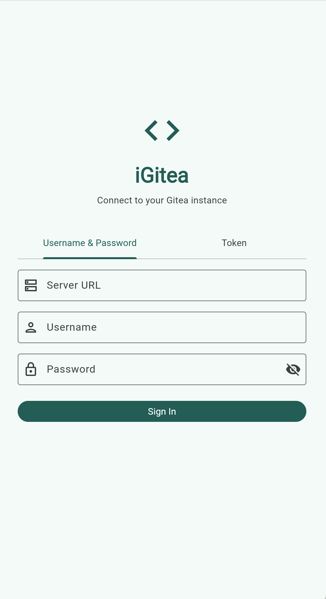
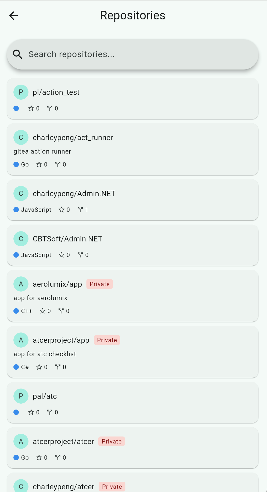
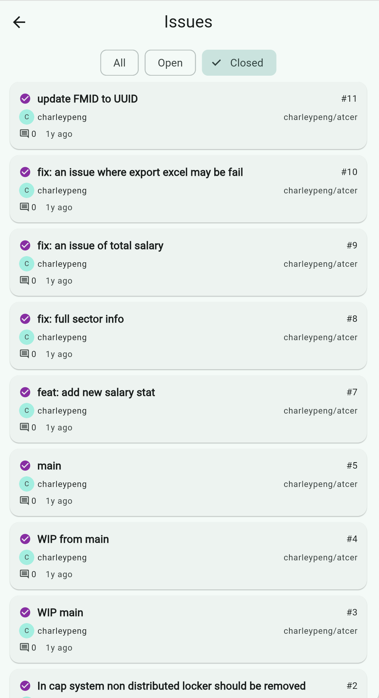

# iGitea

基于 OpenAPI 规范构建的跨平台 [Gitea](https://gitea.io) Flutter 客户端。

## 截图

| 登录 | 仪表盘 | 仓库详情 | Issue 详情 |
|:----:|:------:|:--------:|:----------:|
|  |  |  |  |

## 功能特性

### 核心
- 跨平台：Android、iOS、macOS、Linux、Windows、**Web**
- Clean Architecture + Repository Pattern
- Material 3 设计系统
- 120+ 个数据模型，基于 OpenAPI 规范自动生成
- 35+ 个领域用例，采用 `Either<Failure, T>` 模式

### 认证
- 用户名/密码登录（主要方式）
- Access Token 登录（次要方式）
- OAuth2 支持（计划中）
- 会话持久化与自动恢复

### 仓库
- 仓库列表、搜索、浏览
- 可折叠头部，支持 Star / Fork 操作
- 7 个标签页：代码、Issue、Pull Request、Release、提交、分支、标签
- 文件浏览器：面包屑导航和目录浏览
- 文件查看器：Markdown 渲染、图片展示、代码语法高亮
- 文件编辑：提交消息对话框
- 仓库设置：编辑描述、可见性、功能开关、删除仓库

### Issue 和 Pull Request
- Issue 和 PR 的列表、搜索、筛选
- 详情页：Markdown 正文、状态徽章、作者头像、标签
- 评论：Markdown 渲染与输入
- 关闭/重开 Issue，合并 PR（需确认）

### 组织和团队
- 查看组织信息、仓库列表、团队列表
- 点击组织头像跳转到详情页
- 组织仓库列表支持跳转

### Release
- 浏览 Release 及资源下载
- Release 详情页：正文、资源文件、tarball/zipball 下载链接

### 星标仓库
- 在个人主页查看所有星标仓库
- 一键 Star / Unstar

### 活动流
- 仪表盘显示最近活动
- 支持：创建/删除仓库、推送/删除标签、创建/关闭/重开 Issue 和 PR、评论、分叉、转移

### 通知
- 通知列表与未读标记
- 单条标记已读 / 全部标记已读

### 搜索
- 全局搜索：仓库和 Issue
- 实时搜索结果

### 设置
- 主题：浅色 / 深色 / 跟随系统
- 语言选择（支持 10 种语言）
- 账户信息展示
- 管理员面板：用户管理（仅管理员可见）

### 国际化
- 英语 (en)
- 简体中文 (zh)
- 繁体中文 (zh_TW)
- 日语 (ja)
- 韩语 (ko)
- 西班牙语 (es)
- 法语 (fr)
- 德语 (de)
- 葡萄牙语 (pt)
- 俄语 (ru)

### Deep Link
- `/{owner}/{repo}` — 仓库
- `/{owner}/{repo}/issues/{id}` — Issue
- `/{owner}/{repo}/pulls/{id}` — Pull Request

## 技术栈

| 层级 | 技术 |
|------|------|
| 框架 | Flutter |
| 状态管理 | ChangeNotifier + ListenableBuilder |
| HTTP | http package |
| 存储 | path_provider, shared_preferences |
| 国际化 | flutter_localizations |
| UI | Material 3 |
| 链接 | url_launcher |
| 文件选择 | file_picker |
| Markdown | flutter_markdown |

## 开始使用

### 前置要求

- Flutter SDK >= 3.11.5
- Dart SDK >= 3.11.5

### 构建

```bash
# 安装依赖
flutter pub get

# 运行（开发）
flutter run

# 构建 APK（Android）
flutter build apk --debug

# 构建 macOS
flutter build macos

# 构建 Web
flutter build web
```

### 测试

```bash
flutter analyze
flutter test
```

## 项目进度

所有阶段已完成。

| 阶段 | 描述 | 状态 |
|------|------|------|
| 1 | 项目初始化 | ✅ 完成 |
| 2 | 模型生成 | ✅ 完成 |
| 3 | API 服务 | ✅ 完成 |
| 4 | 仓库层 | ✅ 完成 |
| 5 | 领域用例 | ✅ 完成 |
| 6 | 状态管理 | ✅ 完成 |
| 7 | UI 层 | ✅ 完成 |
| 8 | 测试与质量 | ✅ 完成 |
| 9 | 仓库详情与文件浏览器 | ✅ 完成 |
| 10 | Issue/PR 详情与搜索 | ✅ 完成 |
| 11 | 设置页与管理功能 | ✅ 完成 |
| 12 | 国际化 | ✅ 完成 |

## 许可证

MIT
